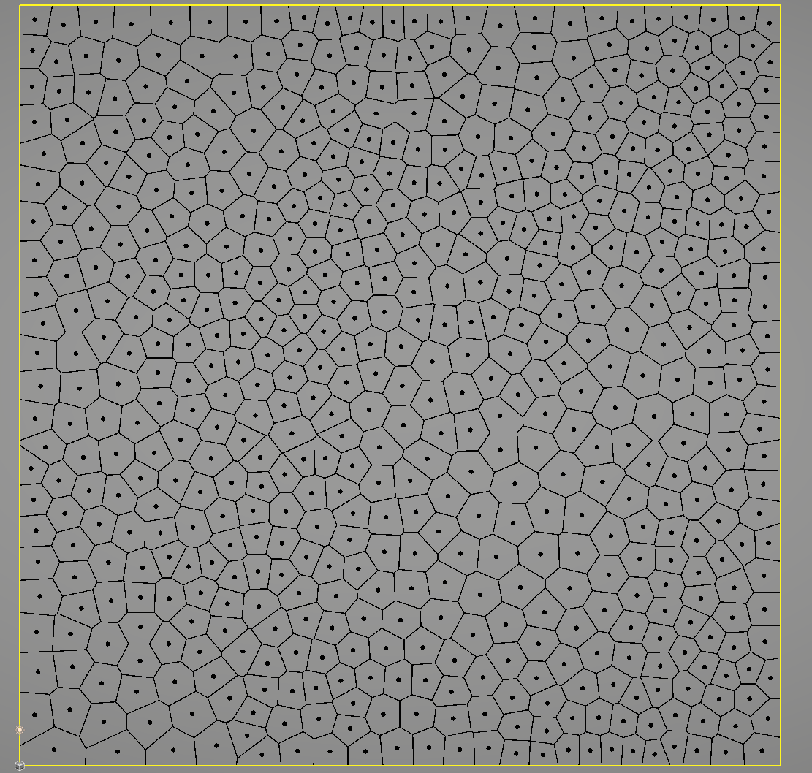
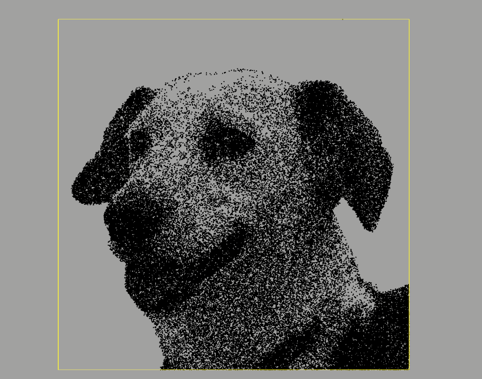

# Weighted-Voronoi-Stippling

**Unity 2022.3.20f1**

**Unity-Delaunay Library By [Julian Ceipek](https://github.com/jceipek/Unity-delaunay)**

**Adopted And Modified By SAJI J ([1ime002](https://x.com/1ime002))**

**Inspired From The Coding Train**

##

**Lloyd's Relaxation & Voronoi Diagram**

**Dijkstra's Algorithm**

**Voronoi Phyllotaxis**

**Weighted Voronoi Stippling Images:**

## **Added Fixed and Updated**

This File Contains:
 + Weighted Voronoi Stippling 
 + Voronoi Diagram
 + Voronoi Phyllotaxis
 + Delaunay Triangulation
 + Fortunes Algorithm
 + Lloyd's Relaxation
 + Dijkstra's Algorithm (To Find Shortest Path) 
 + Spanning Tree of Delaunay Triangulation

## [Lloyd's Relaxation Explanation:](https://en.wikipedia.org/wiki/Lloyd%27s_algorithm)

Area = 1/2 * Summation of (X0*Y1 - X1*Y0)

CrossProduct = X0*Y1 - X1*Y0;

First, the Area is calculated for each cell By iterating through all Vertices

And then calculate the Cross Product of One Vertex(X0,Y0) and the Next Vertex(X1 + 1, Y1 + 1)
last area/=2;

x Component of the Centroid (Cx)= 1/6*Area * Summation of (X0 + X1) * CrossProduct;

y Component of the Centroid (Cy)= 1/6*Area * Summation of (Y0 + Y1) * CrossProduct;

Centroid = (Cx, Cy)

AtLast - Centroid = Centroid/6*Area

**returns** A list of the new points</returns>

## **Sources Used:**

https://en.wikipedia.org/wiki/Lloyd%27s_algorithm

https://www.cs.ubc.ca/labs/imager/tr/2002/secord2002b/secord.2002b.pdf

https://en.wikipedia.org/wiki/Delaunay_triangulation

https://paulbourke.net/geometry/polygonmesh/

https://www.youtube.com/watch?v=Bxdt6T_1qgc

https://www.youtube.com/watch?v=ysLCuqcyJZA

https://www.dotnetoffice.com/2022/10/dijkstra-algorithm-for-determining.html

