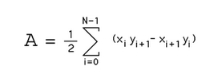
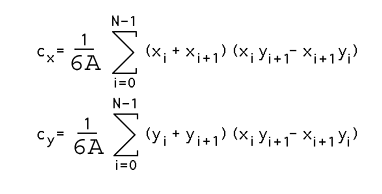

# Weighted-Voronoi-Stippling

Unity-Delaunay Library By Julian Ceipek

Adopted And Modified By SAJI J (1ime002)

Added Fixed and Updated:

This File Contains:

Voronoi Diagram
Delaunay Triangulation
Fortunes Algorithm
Lloyd's Relaxation

Lloyd's Relaxation Explanation:
{

Area = 1/2 * Summation of (X0*Y1 - X1*Y0)

CrossProduct = X0*Y1 - X1*Y0;

First, Area is calculated for each cell By iterating through all of the Vertices
And then calculate the Cross Product of One Vertex(X0,Y0) and the Next Vertex(X1 + 1, Y1 + 1)
last area/=2;

x Component of the Centroid (Cx)= 1/6*Area * Summation of (X0 + X1) * CrossProduct;

y Component of the Centroid (Cy)= 1/6*Area * Summation of (Y0 + Y1) * CrossProduct;

Centroid = (Cx, Cy)
AtLast - Centroid = Centroid/6*Area
<returns> A list of the new points</returns>
}

Sources Used:

https://en.wikipedia.org/wiki/Lloyd%27s_algorithm

https://www.cs.ubc.ca/labs/imager/tr/2002/secord2002b/secord.2002b.pdf

https://en.wikipedia.org/wiki/Delaunay_triangulation

https://paulbourke.net/geometry/polygonmesh/

https://www.youtube.com/watch?v=Bxdt6T_1qgc

